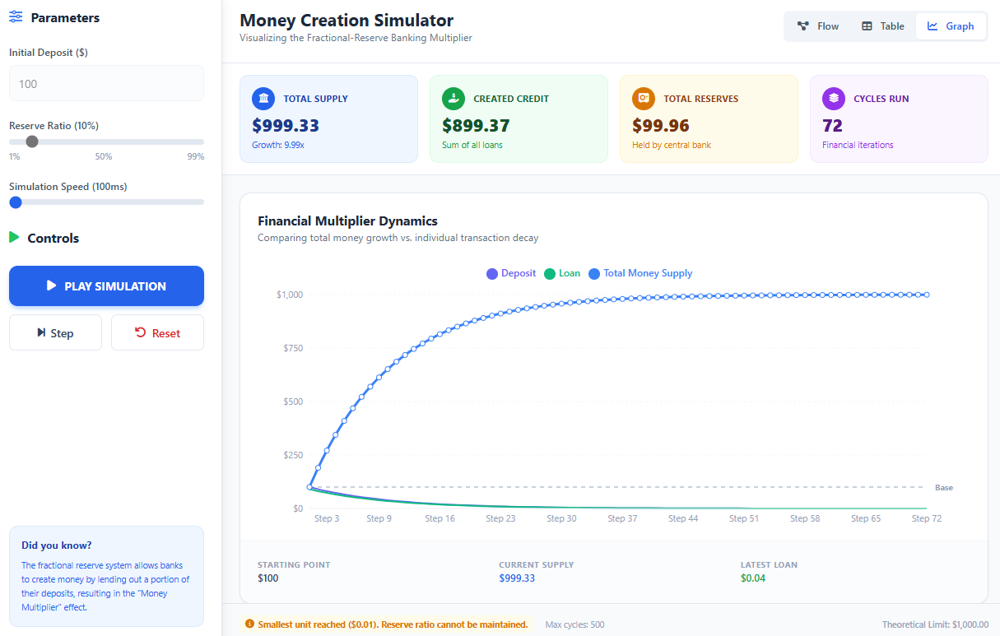

<p align="center">
  <a href="https://dochertydev.github.io/Double-Spend-Problem-Simulator/">
    
  </a>
</p>

<div align="center">

_Click the logo above to try the app via website!_
</div>

<h1 align="center">
Double Spend Problem Simulator
</h1>

<h2 align="center">Visualize the mechanics of money creation in fractional-reserve banking.</h2>

<div align="center">

[](LICENSE) [](https://dochertydev.github.io/Double-Spend-Problem-Simulator/) [](https://github.com/DochertyDev/Double-Spend-Problem-Simulator)

</div>

:star: _Love Double Spend Problem Simulator? Give us a star to help other developers discover it!_

<br />

<div>

</div>

---

## 📋 Table of Contents

- [Overview](#-overview)
  - [Features](#features)
- [Quick Start (Local Development)](#-quick-start-local-development)
  - [Prerequisites](#prerequisites)
  - [Setup Instructions](#setup-instructions)
- [Usage](#️-usage)
- [Technologies Used](#️-technologies-used)
- [Security Notes](#-security-notes)
- [Troubleshooting](#-troubleshooting)
- [Contributing](#-contributing)
- [Support the Project](#-support-the-project)
- [Disclaimer](#️-disclaimer)

## 📄 Overview

The Double Spend Problem Simulator is an interactive web application designed to demystify the concept of money creation within a fractional-reserve banking system. It allows users to visually and numerically explore how an initial deposit can lead to a multiplied money supply, effectively demonstrating the "double-spend" phenomenon in this context. This educational tool is ideal for students, economists, or anyone interested in understanding the fundamental mechanics of modern banking and monetary policy.

## Features

-   **Interactive Simulation:**
    -   **Customizable Parameters:** Easily set the initial deposit amount, adjust the reserve ratio (e.g., 10%), and control the simulation speed.
    -   **Playback Controls:** Utilize step-by-step progression or continuous playback to observe the simulation at your own pace.
-   **Multiple Visualization Modes:**
    -   **Flow Diagram View:** Experience an animated visualization of money movement, tracking deposits, reserves, and loans with clear directional arrows.
    -   **Table View:** Access a detailed numerical breakdown of each simulation cycle, showing deposits, reserves, loans, and the total money supply.
    -   **Graph View:** Observe the growth of the money supply over time through an interactive plot, with data points providing precise values.
-   **Real-Time Analytics:**
    -   **Key Metrics Dashboard:** Monitor the starting deposit, track total money creation, and observe the system-wide money supply in real-time.

## 🚀 Quick Start (Local Development)

This project is a client-side web application. No complex backend setup is required.

### Prerequisites

-   Node.js (v14 or higher)
-   npm (Node Package Manager)

### Setup Instructions

1.  Clone the repository:

    ```sh
    git clone https://github.com/DochertyDev/Double-Spend-Problem-Simulator.git
    ```

2.  Navigate to the project directory:

    ```sh
    cd Double-Spend-Problem-Simulator
    ```

3.  Install dependencies:

    ```sh
    npm install
    ```

4.  Start the development server:

    ```sh
    npm run dev
    ```

    This will typically open the application in your browser at `http://localhost:5173`.

## ⚙️ Usage

1.  **Launch the Application:** After following the "Quick Start" instructions, open the provided local URL in your web browser.
2.  **Configure Simulation:** Use the controls to set your desired "Initial Deposit" and "Reserve Ratio". You can also adjust the "Simulation Speed".
3.  **Start Simulation:** Click the "Start Simulation" button to begin.
4.  **Control Playback:** Use the "Pause", "Step", and "Rerun" buttons to manage the simulation flow.
5.  **Switch Views:** Toggle between "Graph View", "Table View", and "Flow Diagram" to observe the simulation data in different formats.
6.  **Activate Education Mode:** Click the "Education Mode" button to enable contextual explanations and insights.

## 🛠️ Technologies Used

-   **Frontend:** HTML5, CSS3, JavaScript (ES6+)
-   **Development Server:** Vite
-   **Visualizations:** D3.js, Chart.js
-   **Testing:** Jest, Testing Library

## 🔒 Security Notes

This is a client-side, static web application designed for educational purposes. It operates entirely within the user's browser and does not involve any server-side processing, user authentication, or data storage.

-   **No Data Collection:** The application does not collect, store, or transmit any user data.
-   **Local Operation:** All simulations and calculations are performed locally on the user's machine.
-   **No External APIs (beyond CDNs):** The application relies only on local resources and publicly available CDN-hosted libraries (D3.js, Chart.js).
-   **Client-Side Logic:** The core simulation logic is executed in the browser, making it transparent and auditable by users.

## ❓ Troubleshooting

This is a client-side, static web application with no complex dependencies or backend. Therefore, extensive troubleshooting is generally not required.

-   **Issue**: Application does not load or displays a blank page.
    -   **Solution**: Ensure you have run `npm install` and `npm run dev` correctly. Check your browser's developer console for any JavaScript errors. Clear your browser cache if issues persist.
-   **Issue**: Visualizations are not updating or appear static.
    -   **Solution**: Verify that the simulation is running (not paused) and that the "Simulation Speed" is set appropriately. Check for any errors in the browser console that might indicate issues with D3.js or Chart.js.

## 🤝 Contributing

<div align="center">
<a href="https://github.com/DochertyDev/Double-Spend-Problem-Simulator/graphs/contributors">
  
</a>
</div>

We welcome contributions from the community! If you have suggestions for improvements, new features, or bug fixes, please feel free to open an issue or submit a pull request. Before contributing, please ensure your changes align with the project's existing code style and testing practices.

## 🌟 Support the Project

**Love Double Spend Problem Simulator?** Give us a ⭐ on GitHub! Your support helps us reach more users and encourages further development.

<div align="center">
  <p>
      
  </p>
</div>

## ⚠️ Disclaimer

This simulator is intended for educational purposes only to illustrate the principles of fractional-reserve banking and the concept of money creation. It simplifies complex economic models and should not be taken as a precise representation of real-world financial systems or used for financial advice. The "double-spend problem" in this context refers to the economic phenomenon of money multiplication, not a security vulnerability in digital currencies.
